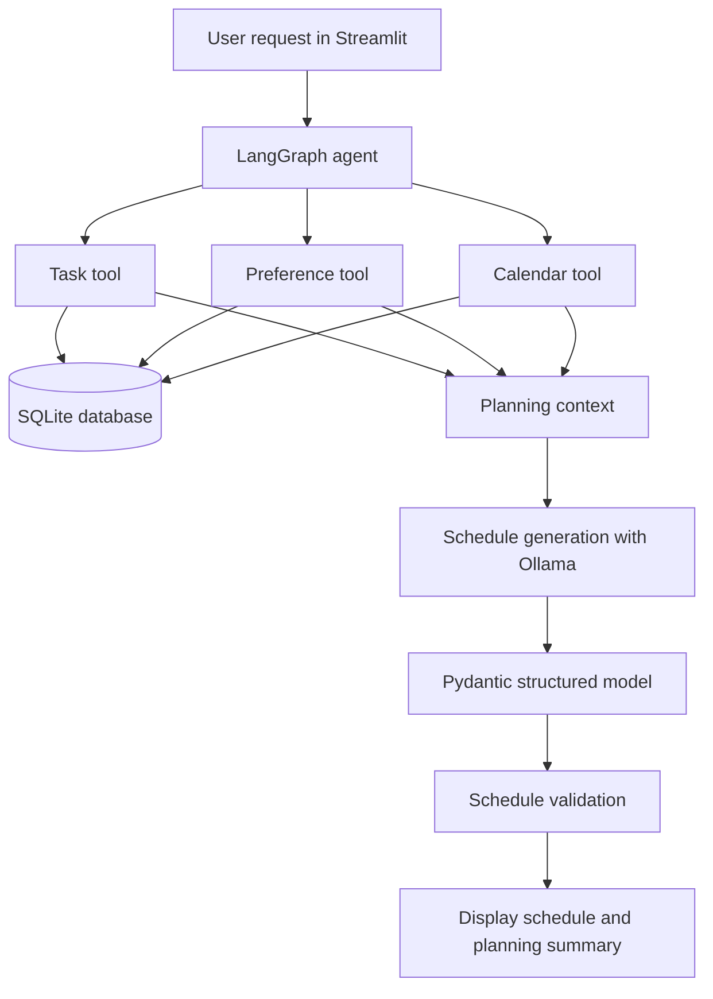

<div align="center">

# 📅 AI Daily Schedule Planner

**An AI-powered daily planning agent that turns your tasks, priorities, preferences, and calendar commitments into a structured schedule.**

Built with **Python · LangGraph · LangChain · Ollama · Streamlit · SQLite**

</div>

---

## ✨ Overview

The **AI Daily Schedule Planner** helps users organize their day with a locally running language model and an agent workflow. Instead of creating a timetable manually, users describe what they need to plan, and the agent gathers available task, preference, and calendar context before generating a schedule.

The project combines LLM-based planning with structured schedule models and validation logic to make the resulting timetable more useful and consistent.

## 🚀 Features

- **Natural-language planning** — describe the day you want to organize in plain English.
- **Tool-enabled agent** — uses tools to retrieve pending tasks, scheduling preferences, and calendar events.
- **Priority-aware planning** — considers task priority, deadlines, estimated duration, and preferred working hours.
- **Calendar-aware scheduling** — treats existing calendar events as fixed commitments.
- **Preference-aware routines** — accounts for wake-up and sleep times, deep-work preferences, breaks, and exercise preferences.
- **Structured output** — presents each activity with start/end times, activity type, priority, and an explanation.
- **Schedule validation** — includes validation logic to check generated schedules and handle planning issues.
- **Local LLM support** — uses Ollama with `qwen2.5:3b` by default, so inference can run locally.
- **SQLite persistence** — stores tasks, preferences, calendar events, and saved schedules in a local database.
- **Streamlit interface** — provides a simple web UI for entering a request and reviewing the plan.

## 🧰 Tech Stack

| Technology | Purpose |
|---|---|
| Python 3.12+ | Core application language |
| LangChain | LLM integration and tool definitions |
| LangGraph | Agent workflow and state management |
| Ollama | Local language-model runtime |
| Qwen 2.5 3B | Default local model |
| Streamlit | User interface |
| Pydantic | Structured schedule data models |
| SQLite | Local persistence |
| `zoneinfo` / `tzdata` | Time-zone handling |

## 🏗️ Architecture



### Planning flow

1. The user describes what they want to plan.
2. The agent can call tools to retrieve relevant task, preference, and calendar information.
3. The application assembles planning context from the available information.
4. The local language model generates a proposed daily schedule.
5. The schedule is checked by the validation layer.
6. The Streamlit UI displays the schedule and the reasoning summary.

## 📁 Project Structure

```text
schedule-tracker-main/
├── App/
│   ├── agent.py           # LangGraph agent and tools
│   ├── models.py          # Pydantic schedule models
│   ├── planner.py         # Schedule generation
│   ├── prompts.py         # Planning instructions
│   ├── ui.py              # Streamlit interface
│   ├── validator.py       # Schedule validation
│   └── test_*.py          # Focused tests
├── database/
│   ├── database.py        # SQLite operations and schema
│   ├── seed.py            # Example task data
│   ├── seed_calender.py   # Example calendar data
│   ├── seed_preferences.py# Example preference data
│   └── schedule.db        # Local SQLite database
├── daily-schedule-agent/
├── src/schedule_tracker/
├── pyproject.toml
├── requirements.txt
└── README.md
```

## ⚙️ Prerequisites

Install the following before running the application:

- Python **3.12 or newer**
- [Git](https://git-scm.com/)
- [Ollama](https://ollama.com/)
- Enough memory to run the selected local model

## 🛠️ Installation & Setup

### 1. Clone the repository

```bash
git clone <YOUR_GITHUB_REPOSITORY_URL>
cd schedule-tracker-main
```

Replace `<YOUR_GITHUB_REPOSITORY_URL>` with your repository URL.

### 2. Create and activate a virtual environment

**Windows (PowerShell)**

```powershell
py -3.12 -m venv .venv
.\.venv\Scripts\Activate.ps1
```

**macOS / Linux**

```bash
python3.12 -m venv .venv
source .venv/bin/activate
```

### 3. Install dependencies

```bash
python -m pip install --upgrade pip
pip install -r requirements.txt
```

### 4. Install and start the local model

Install Ollama from [ollama.com](https://ollama.com), then download the default model:

```bash
ollama pull qwen2.5:3b
```

Make sure Ollama is running before launching the app. The code currently selects `qwen2.5:3b` in both `App/agent.py` and `App/planner.py`; if you change models, update the relevant configuration consistently.

### 5. Initialize or seed data (optional)

The database module defines the SQLite tables. To add the sample tasks, run the seed script from the project root:

```bash
python -m database.seed
```

**Note:** The seed script inserts example tasks each time it runs. Avoid repeatedly running it unless you want duplicate sample tasks. The repository also contains seed scripts for preferences and calendar events; inspect those scripts and run them if you want their example data.

### 6. Launch the Streamlit app

From the project root:

```bash
streamlit run App/ui.py
```

Streamlit will print a local URL—usually `http://localhost:8501`—to open in your browser.

## 💬 Example Request

Try entering:

> Create my schedule for tomorrow. Prioritize high-priority tasks, reserve a block for deep work, include breaks and exercise, and avoid conflicts with my existing calendar events.

The generated plan displays the date, activity time range, activity name, event type, priority, explanation, and an overall planning summary.

## 🗃️ Data & Configuration

The SQLite database is located at `database/schedule.db`. The application includes data access functions for:

- Tasks and their priorities, deadlines, estimated durations, and status
- Daily scheduling preferences
- Calendar events
- Saved schedules

To personalize the planner, populate the database with your own tasks, preferences, and calendar events. The current interface is focused on submitting a planning request and viewing its result; it does not provide a complete CRUD dashboard for managing every database record.

## 🧪 Tests

Test files are included for the planner, validator, and OpenAI connectivity. Run the focused local tests from the repository root:

```bash
python -m pytest App/test_planner.py App/test_validator.py
```

If `pytest` is not installed in your environment:

```bash
pip install pytest
```

The OpenAI test is separate from the default Ollama flow and may require a valid API key and additional configuration. The main planner is configured for Ollama by default.

## 🔐 Security & Privacy

- Do not commit API keys, credentials, `.env` files, or private database contents.
- Keep secrets in environment variables or a local `.env` file and ensure that file is ignored by Git.
- Review the sample database before publishing it if it contains personal or test data.
- The default LLM configuration uses a local Ollama model. Any alternative provider may send prompts or context to that provider, depending on its configuration and terms.

## ⚠️ Current Scope & Limitations

- The default model is `qwen2.5:3b`; output quality and response time depend on your hardware and the model.
- Results depend on the quality and completeness of the stored task, preference, and calendar data.
- AI-generated schedules should be reviewed before relying on them.
- Google Calendar synchronization and OAuth are not described as implemented features in this repository version.
- `requirements.txt` includes multiple LLM integrations, but the main agent and planner shown here are configured to use Ollama by default.

## 🛣️ Possible Future Improvements

- Add a full task, preference, and calendar management dashboard.
- Add schedule editing, approval, and rescheduling.
- Integrate Google Calendar through a secure OAuth flow.
- Add configurable LLM providers and model selection.
- Improve automated tests for conflicts, deadlines, and edge cases.
- Add deployment configuration, authentication, and per-user data isolation.
- Add export options such as calendar files or PDF summaries.

## 🤝 Contributing

Contributions and suggestions are welcome.

1. Fork the repository.
2. Create a branch: `git checkout -b feature/your-feature`.
3. Make your changes and test them locally.
4. Commit your changes: `git commit -m "Add: your feature"`.
5. Push the branch and open a pull request.

## 📄 License

No license file was present in the supplied project archive. Add a `LICENSE` file before describing the project as open source or permitting reuse.

---

<div align="center">

**Built to make daily planning more organized, realistic, and AI-assisted.**

</div>
